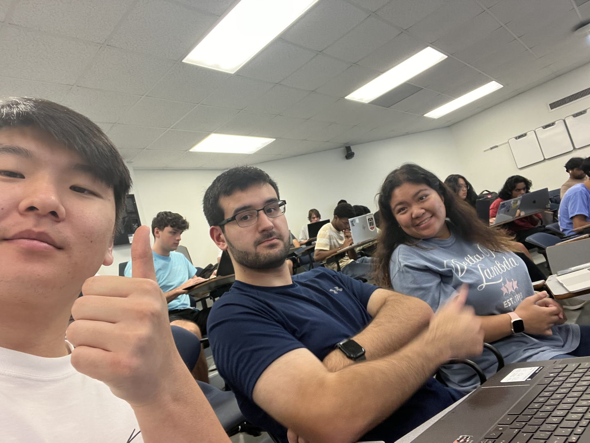

# Weekly Status Report

**Project Name:**  TAGSearch
**Group Name:**  TAGS
**Project Manager:** Spencer Freese

---

## Group Selfie
Upload image to `/images/` and link it below:

This was the group photo taken on the first day. Due to the entire group not being together on future days, or us forgetting to get a picture of the full group later, this picture is all we have. 
---

## Progress Summary - **Week #1:**  Monday, Oct 27 -  Sunday, Nov 2

** What we completed this week:**  
- Set up our group repo
- Completed the figma mockup of our website

** Issues / blockers encountered:**  
-  No issues encountered as the deliverables due this week were simple.

** Goals for next week:**  
-  Begin implementing our mockup into code.

---

## Progress Summary - **Week #2:**  Monday, Nov 3 -  Sunday, Nov 9

** What we completed this week:**  
- Spencer created the sign up page and website logo. Also began working on the login page.  
- Alina got our project set up with react. 
- Gabe and Trent began drafting ways to implement their respective pages that they made in figma. 

** Issues / blockers encountered:**  
-  I (Spencer) had trouble installing react myself. I followed the guide in the textbook but encountered errors. Luckily Alina got it set up easily.
-  We are all inexperienced at using git in a team setting, so we needed to learn the basics of effectively branching and communicating our changes with each other. 

** Goals for next week:**  
-  Since the front end functionality is due this week, next week we will focus on back end functionality.
-  We will also finalize how each page will interact with each other and our database. 

---

## Progress Summary - **Week #3:**  Monday, Nov 10 -  Sunday, Nov 16

** What we completed this week:**  
- The front end functionality was completed. Alina, Trent, and Gabriel finished up their respective pages.
-  I (Spencer) created the demonstration video and PDF needed for the submission.

** Issues / blockers encountered:**  
-  No notable issues. Just normal coding bugs that required testing and fixing.
-  

** Goals for next week:**  
-  Since the enitre website needs to be done this week, we will need to implement our database, apis, and page functionality.
-  Also begin plans on how to present our website. 

---

## Progress Summary - **Final Week:**  Monday, Nov 17 -  Sunday, Nov 23

** What we completed this week:**  
- Completed all required functionality. 
- I (Spencer) completed the functionality for signing up and logging in users. Also completed the WEEKLY_STATUS, README, and video demonstration.
- Gabriel sourced job listings from an api and allowed authhenticated users to view them.
- Alina implemented CRUD functionality in the form of job listings. Registered users can create and edit job listings and view listings other users have created.
- Trent implemented some tailwind and css styling to make the website more professional looking and adapt to different screen sizes.

** Issues / blockers encountered:**  
-  General bugs that come with coding. Everyone seemed able to fix issues they encountered. 

** Video preparation plans:**  
-  I will complete the video using obs. Will submit the file on elc and a youtube link hosting the video.
-  
** Presentation preparation plans:**  
-  Each group member will present the parts he/she worked on. 
-  This way each person will present the components they are most knowledgable about.
---

